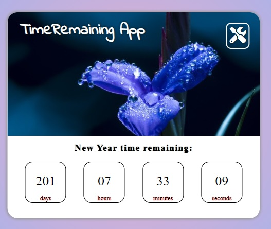

# DateTimeApp

## Demo

[**click live demo of the project**](https://dominiksiejka.github.io/DateTimeApp)



## Table of Contents

- [About the Project](#description)
- [How to use](#how-to-use)
- [Technologies used](#built-with)
- [Setup steps](#setup)
- [Sources](#sources)
- [License](#license)

## Description

DateTimeApp it calculates the time remaining from the special date in the future passed by you (it my be your birthday date, new year date) to the todays date. You can also pass the event title and the url to the image that you would like to be shown in the app.

## How to use

In order to change title and date to your special event press the tools button at the top right corner of the app. Then you need to fill in all informations including the url of the image.

## Built with

- HTML5
- CSS/SASS
- Vanilla JavaScript

## Setup

```
with BASH

# clone the remote repo to your local one
$ git clone https://github.com/dominiksiejka/DateTimeApp.git

# open the index.html file or use your code editor to open it with live server

```

## Sources

- Icons from [Font Awesome ](https://fontawesome.com)
- Font from [Google Fonts ](https://fonts.google.com/)

## License

- MIT © [Dominik Siejka ](https://github.com/dominiksiejka/DateTimeApp)
